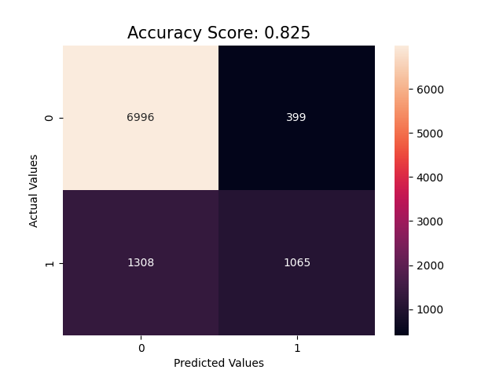
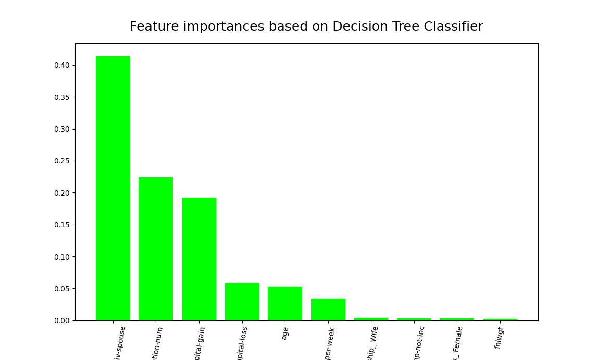
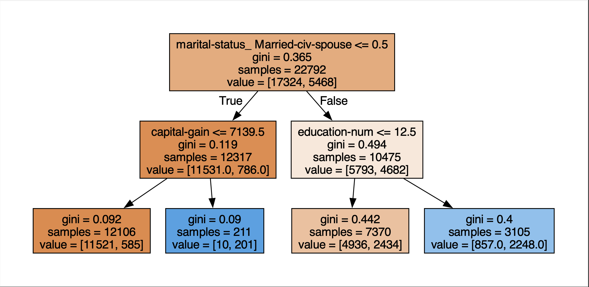

### Salary Forecasting with Decision Tree Model

This project uses a decision tree model to predict whether people's salaries will be higher or lower than 50K. It includes data pre-processing, model training and evaluation steps.

Outputs:

